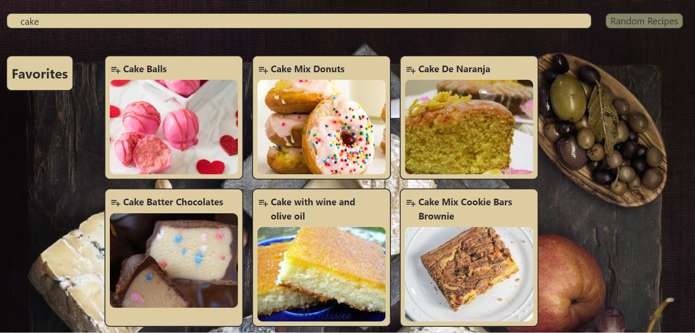

# Random Flavors

The website for the app can be found [here](https://ryansheehy0.github.io/Random_Flavors/).

## Description

An app to search for your favorite recipes and generate two randomly chosen recipes from your favorites list. The motivation behind this project was to create an app that makes planning weekend meals easier by recommending two randomly chosen recipes - one for each day of the weekend - for the user to gather ingredients for and make.

## User Story
AS A human who consumes food 

I WANT to generate a list of recipes for the weekend

SO THAT I can make my shopping and cooking easier on weekends.

## Acceptance Criteria

GIVEN A Random Flavors with a form input

WHEN I search for a recipe.

THEN I am presented with the recipes associated with input data.

THEN I select a recipe and add to the favorites.

WHEN I click on the recipe 

THEN I presented with a modal for recipe instruction with X   symbol on the top right  for close the modal

When I want to delete the recipe from the favorites

THEN I press the trash icon symbol to delete the particular item

## Minimum Viable Product
- Search for recipes you like
- Add them to favorites 
- Randomly generate two recipes from favorites list upon request (in the form of pushing a button)

## Features to add later
- Extend the days. More than 2 days.
- Different lists (dinner, dessert, salads, etc.)
- Use ingredients you have to suggest recipes with those ingredients
- Festive recipes for holidays/events
- Outdoor food recipes like bbq or campfire food 
- Recipes for diets (low carb, Keto, etc.)
- Add logo/mascot
- Multiple cultural cuisine categories

## Credits
We used the [Spoonacular food API](https://spoonacular.com/food-api) and the [The Cocktail DB drink API](https://www.thecocktaildb.com/api.php) to obtain the recipes for the app. We also used [Tailwind CSS](https://tailwindcss.com/) as a framework.
